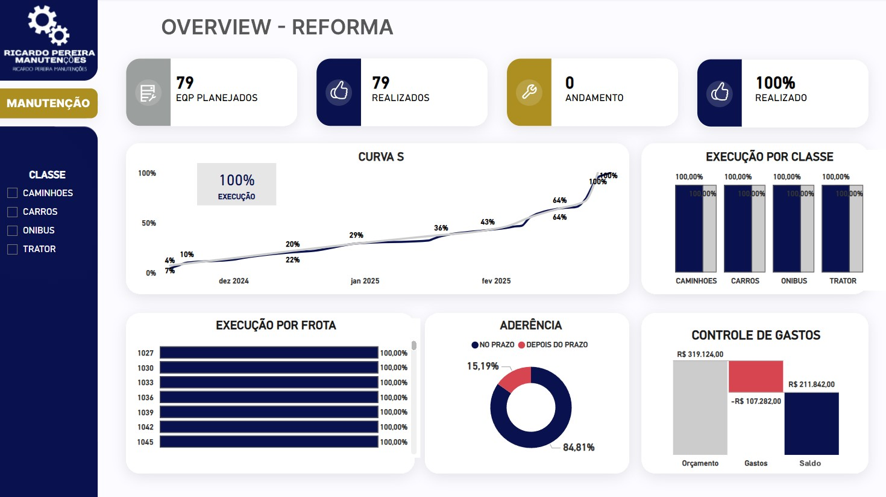

## Dashboard de Manutenção de Frotas 

O painel de manutenção de frotas apresenta uma visão clara e estratégica do planejamento de reforma das frotas ao longo dos meses. Ele exibe a quantidade de veículos programados para reforma, comparando os valores planejados e executados para medir a aderência ao cronograma.

A análise visual inclui uma Curva S, que permite acompanhar o progresso acumulado do planejamento e da execução ao longo do tempo, facilitando a identificação de desvios. Além disso, um gráfico de cascata detalha os gastos, mostrando a distribuição dos custos e evidenciando os principais impactos financeiros ao longo do processo de manutenção.

Com essa abordagem, o dashboard fornece uma visão abrangente para tomada de decisões mais assertivas, permitindo ajustes estratégicos para melhorar a eficiência operacional e o controle de custos.

