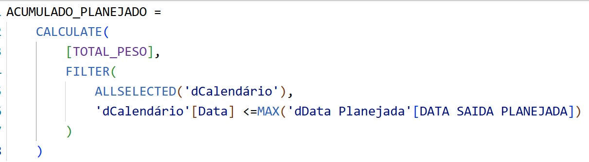
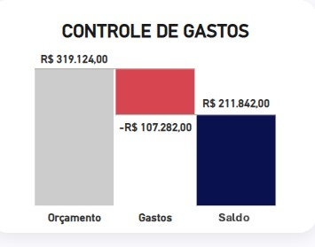

## Dashboard de Manutenção de Frotas 

O painel de manutenção de frotas apresenta uma visão clara e estratégica do planejamento de reforma das frotas ao longo dos meses. Ele exibe a quantidade de veículos programados para reforma, comparando os valores planejados e executados para medir a aderência ao cronograma.

A análise visual inclui uma Curva S, que permite acompanhar o progresso acumulado do planejamento e da execução ao longo do tempo, facilitando a identificação de desvios. Além disso, um gráfico de cascata detalha os gastos, mostrando a distribuição dos custos e evidenciando os principais impactos financeiros ao longo do processo de manutenção.

Com essa abordagem, o dashboard fornece uma visão abrangente para tomada de decisões mais assertivas, permitindo ajustes estratégicos para melhorar a eficiência operacional e o controle de custos.

## Curva S

A Curva S é essencial para acompanhar o progresso de um projeto ao longo do tempo, comparando o planejado com o executado. Ela permite identificar atrasos, antecipações e desvios no cronograma, auxiliando na tomada de decisões estratégicas para manter a aderência ao planejamento e otimizar recursos.

## Calculo do Acumulado 

A fórmula em DAX mostrada na imagem calcula o acumulado planejado para a Curva S. Ela utiliza a função CALCULATE para somar o [TOTAL_PESO], filtrando o calendário (dCalendário) para considerar apenas as datas até o máximo da "DATA SAIDA PLANEJADA".

Isso permite construir a Curva S ao longo do tempo, mostrando o progresso acumulado do planejamento. O uso de ALLSELECTED garante que o cálculo respeite o contexto de seleção do relatório, mantendo a aderência aos filtros aplicados.

## Gráfico de Cascata

O gráfico de cascata é uma ótima ferramenta para visualizar como um valor total é afetado por uma série de entradas e saídas ao longo de uma sequência. Com o orçamento, gastos e saldo, o gráfico de cascata pode ser utilizado para mostrar como cada um desses componentes contribui para a variação do saldo final

